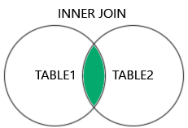
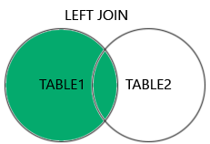
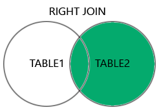
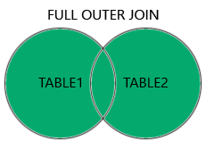
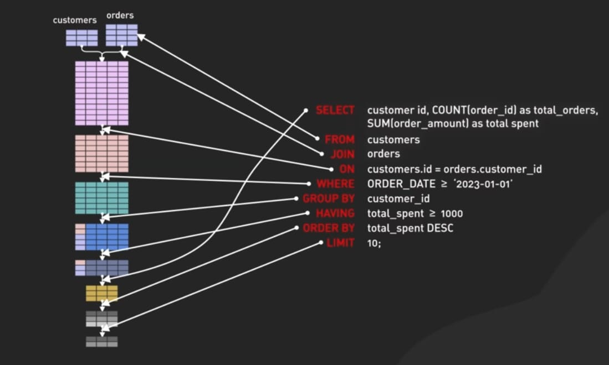

# Structured Query Language (SQL)

## What is SQL
SQL is used to perform operations on the records stored in the database, such as updating records, inserting records, deleting records, creating and modifying database tables.

## SQL Syntax
We  can write the keywords of SQL in both uppercase and lowercase, but writing the SQL keywords in uppercase improves the readability of the SQL query. 

## Simple Example of SQL statement
        1. SELECT * FROM "table_name";
This statement selecting all column from table.

## Most Important SQL Commands and Statements
    a) Select statement :- Used to read data from database and show as the output to user.
    b) Create Table Statement :- Used to create new Table in SQL Database.
    c) Update statement :- Used to changes or modifies the stored data in the SQL database.
    d) Delete Statement :- Used to deletes the stored data from the SQL database.
    e) Alter Table statement :-  Used to adds, deletes, and modifies the columns of the table.
    f) Drop Table Statement :- Used to removes the table completely. 
    g) Create database statement :- This statement is used to create new database.
    h) Drop statement :- This command is used to deletes the existing database with all Tables.
    i) Insert Into statement :- This command is used to insert the data into existing Table.
    j) Truncate Table statement :- Deletes all the stored records from the table not deletes Table.
    k) Commit Statement :- Saves the changes permanently, which are done in the transaction.
    l) Rollback Statement :- This statement undo transactions and operations which are not yet saved to database. 

## SQL Key
### PRIMARY KEY
A column is called primary key that uniquely identifies each row in the table.
### FOREIGN KEY
Foregin key is a field or collection of fields in one table, that refers to the PRIMARY KEY in another table.
### Composite key
composite key is a combination of two or more columns in a table that can be used to uniquely identify each row in the table when the columns are combined uniqueness is guaranteed, but when it taken individually it does not guarantee uniqueness.

SQL Syntax to specify composite key:

       CREATE TABLE TABLE_NAME
       (COLUMN_1, DATA_TYPE_1,
       COLUMN_2, DATA_TYPE_2,
       ...
       PRIMARY KEY (COLUMN_1, COLUMN_2, ...));  

### Unique key 
Unique key is a set of one or more than one columns of a table that uniquely identify a record in a database table.

       CREATE TABLE students(
       S_Id int NOT NULL UNIQUE,  
       LastName varchar (255) NOT NULL,  
       FirstName varchar (255),  
       City varchar (255));
       
### Alternate key
Alternate key is a secondary key, Let's take an example of student it can contain NAME, ROLL NO., ID and CLASS. Here ROLL NO. is primary key and rest of all columns like NAME, ID and CLASS are alternate keys.

## SQL Aggregate Functions
An aggregate function is a function that performs a calculation on a set of values, and returns a single value.It is is also used with GROUP BY clause.

The most commonly used SQL aggregate functions are:

    • MIN() - returns the smallest value within the selected column 
    • MAX() - returns the largest value within the selected column 
    • COUNT() - returns the number of rows in a set 
    • SUM() - returns the total sum of a numerical column 
    • AVG() - returns the average value of a numerical column    

Example :- 
     

     SELECT MIN(Price) AS SmallestPrice
     FROM Products;

     SELECT MIN(Price) AS SmallestPrice, CategoryID
     FROM Products
     GROUP BY CategoryID;

## SQL JOIN
A JOIN clause is used to combine rows from two or more tables, based on a related column between them.

### Different Types of SQL JOINs
        INNER JOIN: Returns records that have matching values in both tables.

        LEFT JOIN: Returns all records from the left table, and
        the matched records from the right table 

        RIGHT JOIN: Returns all records from the right table, 
        and the matched records from the left table.

        FULL JOIN: Returns all records when there is a match in
        either left or right table.

## SQL order of execution
Defines the order in which the clauses of a query are evaluated. The correct order of execution in SQL is FROM, WHERE, GROUP BY, HAVING, SELECT, DISTINCT, ORDER BY and LIMIT.It is very important to understand.

Refer this image

## Reference
[text](https://www.javatpoint.com/sql-tutorial)
[text](https://www.w3schools.com/sql/)